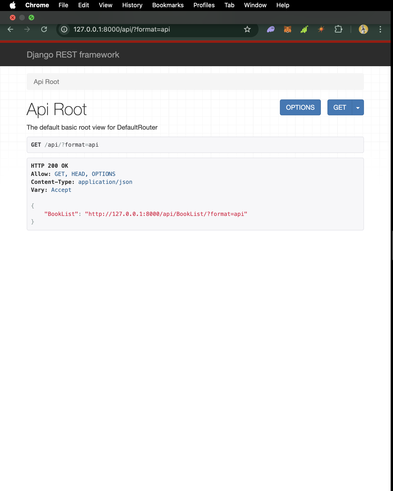
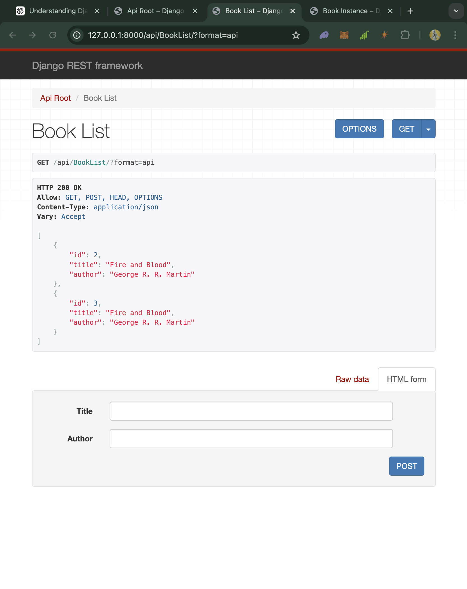

How to test the API using a REST client or curl commands

Rest client
- Run the server
- 
- Now click on this link, http://127.0.0.1:8000/api/BookList/?format=api
- Now enter a Book title and Author and click on Post
- 

